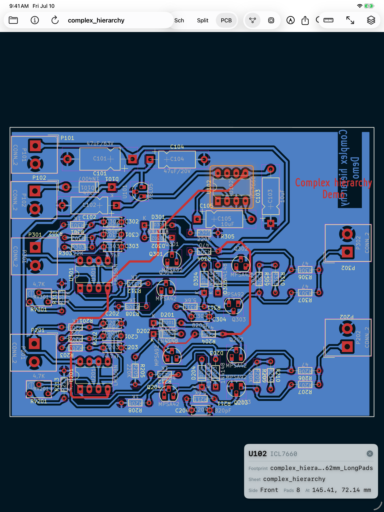
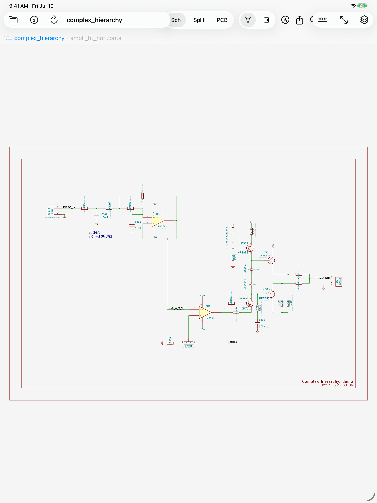

# kicadreview-site

Support and privacy pages for **KiCadReview**, an iPad app for
design-reviewing [KiCad](https://www.kicad.org) projects: schematics
and boards rendered natively, cross-probing, net highlight, measuring,
Apple Pencil markup, and PDF export — read-only, fully on-device.

Served via GitHub Pages:

- **Support / landing** — <https://kpezeshki.github.io/kicadreview-site/>
- **Privacy policy** — <https://kpezeshki.github.io/kicadreview-site/privacy.html>
  (short version: the app collects no data)

Screenshots show the app's bundled demo project (`complex_hierarchy`,
from the KiCad distribution, © its contributors).

## License

GPL-3.0-or-later, matching the KiCad project — see [LICENSE](LICENSE).
KiCad is a trademark of KiCad Services Corporation and/or The Linux
Foundation; KiCadReview is independent and not endorsed by the KiCad
project.
